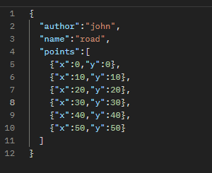
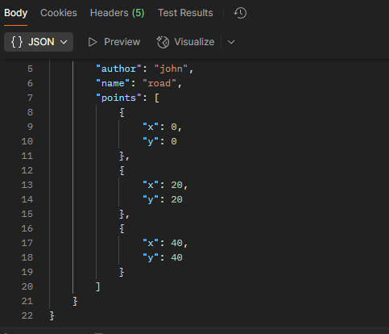
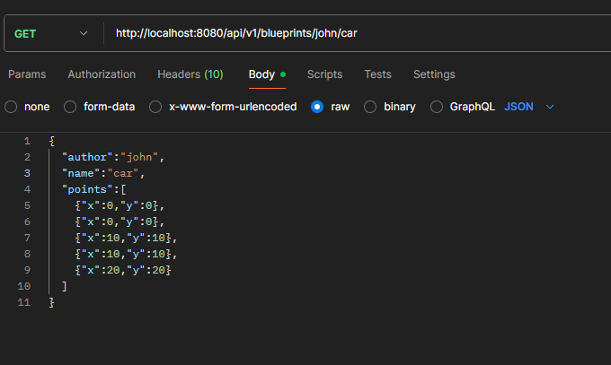
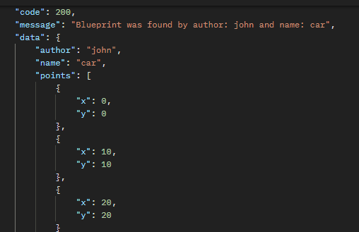

## Laboratorio #4 – REST API Blueprints (Java 21 / Spring Boot 3.3.x)
# Escuela Colombiana de Ingeniería – Arquitecturas de Software  

---

## 📋 Requisitos
- Java 21
- Maven 3.9+

## ▶️ Ejecución del proyecto
```bash
mvn clean install
mvn spring-boot:run
```
Probar con `curl`:
```bash
curl -s http://localhost:8080/blueprints | jq
curl -s http://localhost:8080/blueprints/john | jq
curl -s http://localhost:8080/blueprints/john/house | jq
curl -i -X POST http://localhost:8080/blueprints -H 'Content-Type: application/json' -d '{ "author":"john","name":"kitchen","points":[{"x":1,"y":1},{"x":2,"y":2}] }'
curl -i -X PUT  http://localhost:8080/blueprints/john/kitchen/points -H 'Content-Type: application/json' -d '{ "x":3,"y":3 }'
```

> Si deseas activar filtros de puntos (reducción de redundancia, *undersampling*, etc.), implementa nuevas clases que implementen `BlueprintsFilter` y cámbialas por `IdentityFilter` con `@Primary` o usando configuración de Spring.
---

Abrir en navegador:  
- Swagger UI: [http://localhost:8080/swagger-ui.html](http://localhost:8080/swagger-ui.html)  
- OpenAPI JSON: [http://localhost:8080/v3/api-docs](http://localhost:8080/v3/api-docs)  

---

## 🗂️ Estructura de carpetas (arquitectura)

```
src/main/java/edu/eci/arsw/blueprints
  ├── model/         # Entidades de dominio: Blueprint, Point
  ├── persistence/   # Interfaz + repositorios (InMemory, Postgres)
  │    └── impl/     # Implementaciones concretas
  ├── services/      # Lógica de negocio y orquestación
  ├── filters/       # Filtros de procesamiento (Identity, Redundancy, Undersampling)
  ├── controllers/   # REST Controllers (BlueprintsAPIController)
  └── config/        # Configuración (Swagger/OpenAPI, etc.)
```

> Esta separación sigue el patrón **capas lógicas** (modelo, persistencia, servicios, controladores), facilitando la extensión hacia nuevas tecnologías o fuentes de datos.

---

## 📖 Actividades del laboratorio

### 1. Familiarización con el código base
- Revisa el paquete `model` con las clases `Blueprint` y `Point`.  
- Entiende la capa `persistence` con `InMemoryBlueprintPersistence`.  
- Analiza la capa `services` (`BlueprintsServices`) y el controlador `BlueprintsAPIController`.

### 2. Migración a persistencia en PostgreSQL
- Configura una base de datos PostgreSQL (puedes usar Docker).  
- Implementa un nuevo repositorio `PostgresBlueprintPersistence` que reemplace la versión en memoria.  
- Mantén el contrato de la interfaz `BlueprintPersistence`.

### Adición de dependencias

para manejar PostgreSQL a los blueprints, se debia manejar primero el pom.xml puesto que postgreSQL requiere de una
dependencia y asimismo, la debida importación en el codigo para que este tenga una conexion con la base de datos deseada.

### 3. Buenas prácticas de API REST
- Cambia el path base de los controladores a `/api/v1/blueprints`.  
- Usa **códigos HTTP** correctos:  
  - `200 OK` (consultas exitosas).  
  - `201 Created` (creación).  
  - `202 Accepted` (actualizaciones).  
  - `400 Bad Request` (datos inválidos).  
  - `404 Not Found` (recurso inexistente).  
- Implementa una clase genérica de respuesta uniforme:
  ```java
  public record ApiResponse<T>(int code, String message, T data) {}
  ```
  Ejemplo JSON:
  ```json
  {
    "code": 200,
    "message": "execute ok",
    "data": { "author": "john", "name": "house", "points": [...] }
  }
  ```
### Creacion de ApiResponseBuilder

La siguiente clase tiene como proposito principal el ser aquella que guarda las respuestas de forma ordenada, las cuales 
en esta ocasion son las siguientes:

- success
- created
- accepted
- badRequest
- notFound
- internalServerError
- forbidden

junto a esto se hizo uso de "HttpStatus" con la finalidad de evitar quemar el digito de respuesta dentro del codigo y 
mantenerlo de forma mas ordenada, ademas de brindar un mensaje mas normal al respecto con la finalidad de que el usuario
conozca si se logro hacer la peticion o si esta fue falllida por algun motivo en particular retratado en los mensajes.


### 4. OpenAPI / Swagger
- Configura `springdoc-openapi` en el proyecto.  
- Expón documentación automática en `/swagger-ui.html`.  
- Anota endpoints con `@Operation` y `@ApiResponse`.

### Manejo de swagger
swagger tiene un endpoint destinado, el cual tiene como finalidad mostrar la documentación en tiempo real del codigo, permitiendo
conocer cuales son sus endpoints, que parametros solicitan y asimismo como se estan manejando los servicios REST dentro de la 
aplicación, en nuestro caso se estaria realizando con el siguiente endpoint:
```
http://localhost:8080/swagger-ui.html
```
este endpoint nos abre la ventana dedicada a la documentación swagger, donde podremos apreciar como es que se estan comportando
los endpoints actuales que ahora poseen la siguiente ruta base:

```
http://localhost:8080/api/v1/blueprints
```
y por consecuente, que endpoints estan respondiendo a los servicios REST junto a los parametros que deben diligenciar al respecto.

### 5. Filtros de *Blueprints*
- Implementa filtros:
  - **RedundancyFilter**: elimina puntos duplicados consecutivos.  
  - **UndersamplingFilter**: conserva 1 de cada 2 puntos.  
- Activa los filtros mediante perfiles de Spring (`redundancy`, `undersampling`).  

    ### Implementación de filtros

    Dependiendo del filtro que desees implementar, puedes se debe modicar el valor por defcto que se tiene dentro de la clase
    application.properties
- 
    ```
    spring.profiles.active=redundancy // Filtro de redundancia
    spring.profiles.active=undersampling // Filtro de undersampling
    spring.profiles.active=default // Filtro identidad (sin cambios)
    ```
    Esto fue posible por medio de la anotación `@Profile` en las clases que implementan la interfaz `BlueprintsFilter`.

    ###  Pruebas Funcionamiento 

  - Filtro de Redundancia:
  
  

  - Filtro de Undersampling: 
  
  
---

## ✅ Entregables

1. Repositorio en GitHub con:  
   - Código fuente actualizado.  
   - Configuración PostgreSQL (`application.yml` o script SQL).  
   - Swagger/OpenAPI habilitado.  
   - Clase `ApiResponse<T>` implementada.  

2. Documentación:  
   - Informe de laboratorio con instrucciones claras.  
   - Evidencia de consultas en Swagger UI y evidencia de mensajes en la base de datos.  
   - Breve explicación de buenas prácticas aplicadas.  

---

## 📊 Criterios de evaluación

| Criterio | Peso |
|----------|------|
| Diseño de API (versionamiento, DTOs, ApiResponse) | 25% |
| Migración a PostgreSQL (repositorio y persistencia correcta) | 25% |
| Uso correcto de códigos HTTP y control de errores | 20% |
| Documentación con OpenAPI/Swagger + README | 15% |
| Pruebas básicas (unitarias o de integración) | 15% |

**Bonus**:  

- Imagen de contenedor (`spring-boot:build-image`).  
- Métricas con Actuator.  
